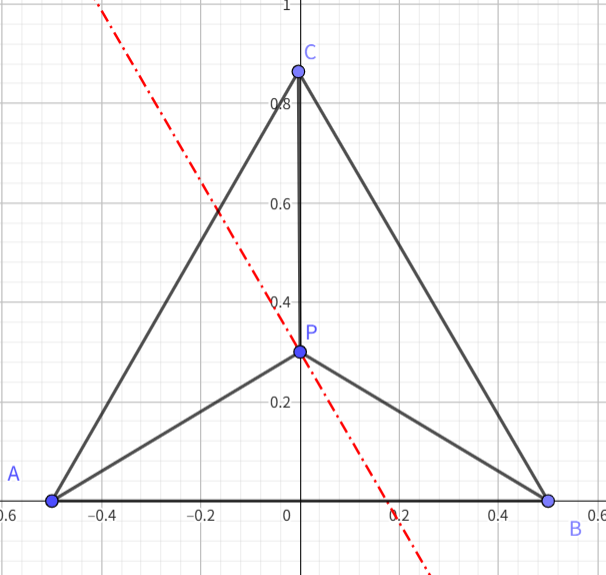
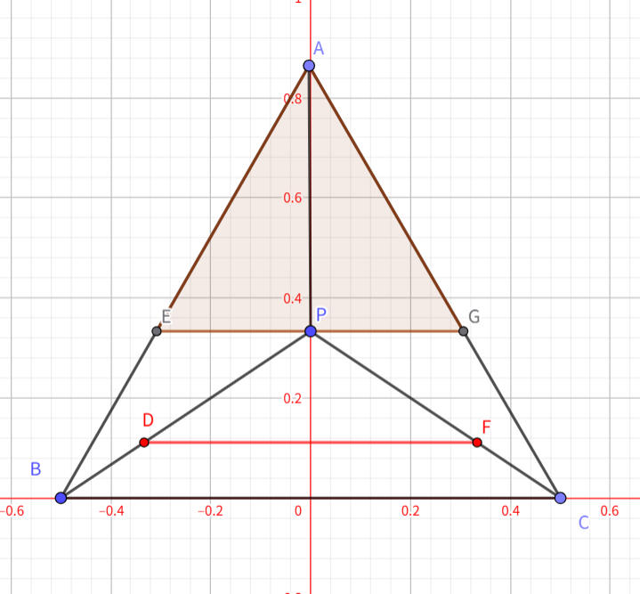

关于三角形tessellation的实现，参考了mesa的实现，并进行了一些修改。
细分着色器中控制点的设置，对于不同的pach类型，控制点的设置方式不同。线与四边形的tessellation的控制点设置对细分点的生成可以较为直观地从各种结果上看出来，而三角形的控制点设置则相对抽象。网上的资料只提到了在重心坐标系下，由于人很难直观地理解三角形细分后的控制点具体是怎么生成以及影响最后的细分结果的。在网上查找相关的资料，发现大部分只是一带而过，没有详细介绍，OpenGL的官网上对于这部分的描述也比较模糊，没有详细讲解的情况下，并不是很好理解。所幸搜索到了一份mesa中这部分的实现代码，把这部分的代码移植过来，在控制顶点参数设置相同的情况下，生成的结果和OpenGL的实现结果一致。
# 前置知识
+ 重心坐标系
推荐一下https://www.geogebra.org/m/ZuvmPjmy，这个链接里有一个关于重心坐标系的可视化，可以直观地看到各点在重心坐标系下的坐标。
关于重心坐标系，这里提一个点，方便后面对代码的解释。
下面是一个正三角形（用正三角更容易理解），三个顶点分别是A，B，C，三边的长度是1，P是三角形中的一个点，ABC三点对应的重心坐标系分别是(u,v,w)。

根据重心坐标系的定义，u = 三角形PBC的面积 / 三角形ABC的面积，如果我们需要插值出一条平行于边BC的直线，那么就我们需要固定u的值，因为只有这样，三角形PBC的面积才会是不变的。

# 插值过程
核心的代码主要在`CHWTessellator::TriGeneratePoints`中，代码里的数字都用了定点数来加速，总共一百行左右，就非常快速精妙地实现了细分点的生成。下面会分块介绍下主要的几个点。
细分的是一个virtual patch，可以把它想象成一个边长是1的等边三角形(这样我们计算的坐标直接就是重心坐标系)。
## 细分点一维求值
`PlacePointIn1D`是用来求一个点在[0,1]区间上的坐标值的，`TESS_FACTOR_CONTEXT`记录的是当前边需要细分成几段和细分的方式，`point`则表明我们需要求取第几个点，最后的`fxpLocation`引用用来返回坐标值
```
CHWTessellator::PlacePointIn1D( const TESS_FACTOR_CONTEXT& TessFactorCtx, int point, FXP& fxpLocation )
```

## 外层细分点生成
这一部分很直观，就是根据gl_TessLevelOuter的设置生成各个边上的细分点。

## 内层细分点
按照gl_TessLevelInner，一层一层地向内细分，gl_TessLevelInner和gl_TessLevelOuter不同，所有内部三角形边细分点的生成都共享gl_TessLevelInner。下面用gl_TessLevelInner=4为例。

### 第0层
最外层的四个点其实并不会用到，我们已经通过gl_TessLevelOuter对原有的三个边的细分进行了设置，它们只是用来展示我们会对virtual patch的三角形各边如何细分的。这一部分在代码里直接跳过了。
```c++
    static const int startRing = 1;
    int numRings = (processedTessFactors.numPointsForInsideTessFactor >> 1);
    for(int ring = startRing; ring < numRings; ring++)
```
### 第1层
开始生成内部各层边的，通过设置起始和中止点的下标，去掉一头一尾两个点。
这一步有点难以理解，结合下面的图，讲下两个关键点

#### 垂直坐标压缩到[0,2/3]
当三角形中的点在▲AEG中时候，u的范围是[2/3, 1]。我们需要确保垂直坐标在三角形之外（不越过重心），那么我们垂直坐标的的范围需要控制在[0, 1/3)，当指定InnerTessFactor时，其环数是InnerTessFactor/2（或者InnerTessFactor/2+1），当我们把垂直坐标变换到[0,2/3)时，最终实际的垂直坐标就映射到了[0,1/3)上，保持在梯形BEGC中。

```c++
    for(int ring = startRing; ring < numRings; ring++)
    {
        int startPoint = ring;
        int endPoint = processedTessFactors.numPointsForInsideTessFactor - 1 - startPoint;

        for(edge = 0; edge < TRI_EDGES; edge++ )
        {
            int parity = edge&0x1; // 为了保证三角形边连续，需要反转方向
            int perpendicularAxisPoint = startPoint;  // 根据当前层数，确定垂直点边的下标
            FXP fxpPerpParam;
            PlacePointIn1D(processedTessFactors.insideTessFactorCtx,perpendicularAxisPoint,fxpPerpParam);
            fxpPerpParam *= FXP_TWO_THIRDS; // Map location to the right size in barycentric space.
                                         // I (amarp) can draw a picture to explain.
                                         // We know this fixed point math won't over/underflow
                                         // 重心坐标系下的坐标不是线性变换的，我们要把坐标从[0,1]变换到[0,2/3]
            fxpPerpParam = (fxpPerpParam+FXP_ONE_HALF/*round*/)>>FXP_FRACTION_BITS; // get back to n.16
            for(int p = startPoint; p < endPoint; p++, pointOffset++) // don't include end: next edge starts with it.
            {
                FXP fxpParam;
                int q = (parity) ? p : endPoint - (p - startPoint); // whether to reverse point given we are defining V or U (W implicit):
                                                         // edge0, VW, has V decreasing, so reverse 1D points below
                                                         // edge1, WU, has U increasing, so don't reverse 1D points  below
                                                         // edge2, UV, has U decreasing, so reverse 1D points below
                PlacePointIn1D(processedTessFactors.insideTessFactorCtx,q,fxpParam);
                // edge0 VW, has perpendicular parameter U constant
                // edge1 WU, has perpendicular parameter V constant
                // edge2 UV, has perpendicular parameter W constant
                const unsigned int deriv = 2; // reciprocal is the rate of change of edge-parallel parameters as they are pushed into the triangle
                // 2可以理解是在均分垂直点对另外两个点的影响
                switch(edge)
                {
                case 0:
                    DefinePoint(/*U*/fxpPerpParam,
                                /*V*/fxpParam - (fxpPerpParam+1/*round*/)/deriv, // we know this fixed point math won't over/underflow
                                /*pointStorageOffset*/pointOffset);
                    break;
```
#### v和w坐标均分垂直坐标系
这部分是个人理解，u+v+w=1，在已经求解出垂直坐标u的情况下，将垂直坐标均匀地分到v和w上，所以v的取值是fxpParam - (fxpPerpParam+1/*round*/)/deriv.

+ 第2层，和第1层一样
+ 第3层，收缩成一个点，这个点其实就是三角形的重心。


# 各细分点坐标计算
上面的得出的是各细分点的重心坐标，最终可以用重心坐标计算各细分点的三维坐标。