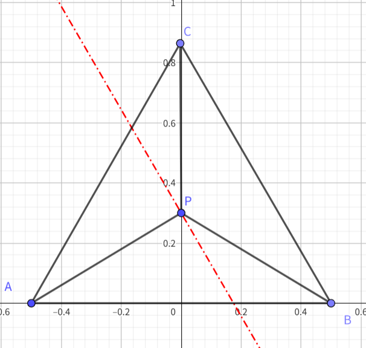

# Triangle Tessellation Implementation

The implementation of triangle tessellation was inspired by the Mesa 3D Graphics Library, with several modifications made. In tessellation shaders, the configuration of control points varies depending on the patch type. For lines and quads, the control point setup is relatively intuitive, and their effects on generated tessellation points are easy to visualize from the output. However, for triangles, the control point setup is more abstract.

Online resources often only mention that barycentric coordinates are used, but it's difficult to intuitively understand how control points are generated or how they influence the final tessellated result. Most documentation found online glosses over this part without going into detail. Even the official OpenGL documentation is quite vague about this topic. Fortunately, I was able to find and study Mesa's implementation, and after porting that part of the code and ensuring the control point parameters are consistent, the output matched OpenGL’s behavior.

---

## Prerequisites

### Barycentric Coordinates

I recommend the following link for an interactive explanation of barycentric coordinates:

👉 https://www.geogebra.org/m/ZuvmPjmy

Here’s one key concept that helps with understanding the code:

Assume an equilateral triangle with vertices A, B, and C and side length 1. Let point **P** be inside the triangle with barycentric coordinates **(u, v, w)**.



According to the definition of barycentric coordinates:  
**u = Area(PBC) / Area(ABC)**

If we want to interpolate a line parallel to edge BC, we must fix the value of **u**, ensuring the area of triangle PBC remains constant.

---

## Tessellation Process

The core logic lies in the method:

```cpp
CHWTessellator::TriGeneratePoints
```

This method uses fixed-point math to speed up computation. It's about 100 lines long but implements tessellation generation in a clean and efficient way.

The tessellated surface is a virtual patch — you can imagine it as an equilateral triangle of side length 1. This means the coordinates we calculate are directly in barycentric space.

---

### 1D Subdivision Evaluation

`PlacePointIn1D` is used to calculate the position of a point in the range [0, 1].

```cpp
CHWTessellator::PlacePointIn1D(
    const TESS_FACTOR_CONTEXT& TessFactorCtx,
    int point,
    FXP& fxpLocation
)
```

- `TessFactorCtx`: contains edge subdivision configuration
- `point`: index of the current point to evaluate
- `fxpLocation`: output fixed-point coordinate

---

## Outer Edge Tessellation

This part is straightforward — it generates subdivision points on triangle edges based on `gl_TessLevelOuter`.

---

## Inner Tessellation

The interior is subdivided using `gl_TessLevelInner`. All inner triangles share the same inner tessellation level.

We use an example with:

```glsl
gl_TessLevelInner = 4
```


### Ring 0

The outermost 4 points are not used directly since they are already generated by `gl_TessLevelOuter`. They simply illustrate how the edges are subdivided. This ring is skipped in code:

```cpp
static const int startRing = 1;
int numRings = (processedTessFactors.numPointsForInsideTessFactor >> 1);
for (int ring = startRing; ring < numRings; ring++)
```

---

### Ring 1 (First Interior Layer)

Now we generate points for each edge within the triangle.

#### Mapping Perpendicular Coordinates to [0, 2/3]

When a point is within triangle ▲AEG, its **u** value falls in `[2/3, 1]`.  
To avoid exceeding the triangle bounds (especially past the centroid), we rescale perpendicular coordinates to `[0, 2/3)` so that they remain within the triangle — specifically within trapezoid **BEGC**.


Key code snippet:

```cpp
for (int ring = startRing; ring < numRings; ring++) {
    int startPoint = ring;
    int endPoint = processedTessFactors.numPointsForInsideTessFactor - 1 - startPoint;

    for (int edge = 0; edge < TRI_EDGES; edge++) {
        int parity = edge & 0x1;
        int perpendicularAxisPoint = startPoint;
        FXP fxpPerpParam;
        PlacePointIn1D(processedTessFactors.insideTessFactorCtx, perpendicularAxisPoint, fxpPerpParam);

        fxpPerpParam *= FXP_TWO_THIRDS;
        fxpPerpParam = (fxpPerpParam + FXP_ONE_HALF) >> FXP_FRACTION_BITS;

        for (int p = startPoint; p < endPoint; p++, pointOffset++) {
            FXP fxpParam;
            int q = (parity) ? p : endPoint - (p - startPoint);
            PlacePointIn1D(processedTessFactors.insideTessFactorCtx, q, fxpParam);

            const unsigned int deriv = 2;

            switch (edge) {
            case 0:
                DefinePoint(
                    /* U */ fxpPerpParam,
                    /* V */ fxpParam - (fxpPerpParam + 1) / deriv,
                    /* Offset */ pointOffset
                );
                break;
```

---

#### Even Split Between V and W

Given that **u + v + w = 1**, and **u** is already known, we evenly distribute the remaining portion between **v** and **w**. That’s why **v = fxpParam - (fxpPerpParam + 1) / deriv**.

---

- **Ring 2**: Follows same logic as Ring 1
- **Ring 3**: Collapses to a single point — the centroid of the triangle.

---

## Converting to 3D Coordinates

All computed tessellation points are in **barycentric space**. To get their actual 3D positions, apply a weighted combination of the original triangle’s vertices using their **(u, v, w)** values:

```cpp
P = u*A + v*B + w*C
```